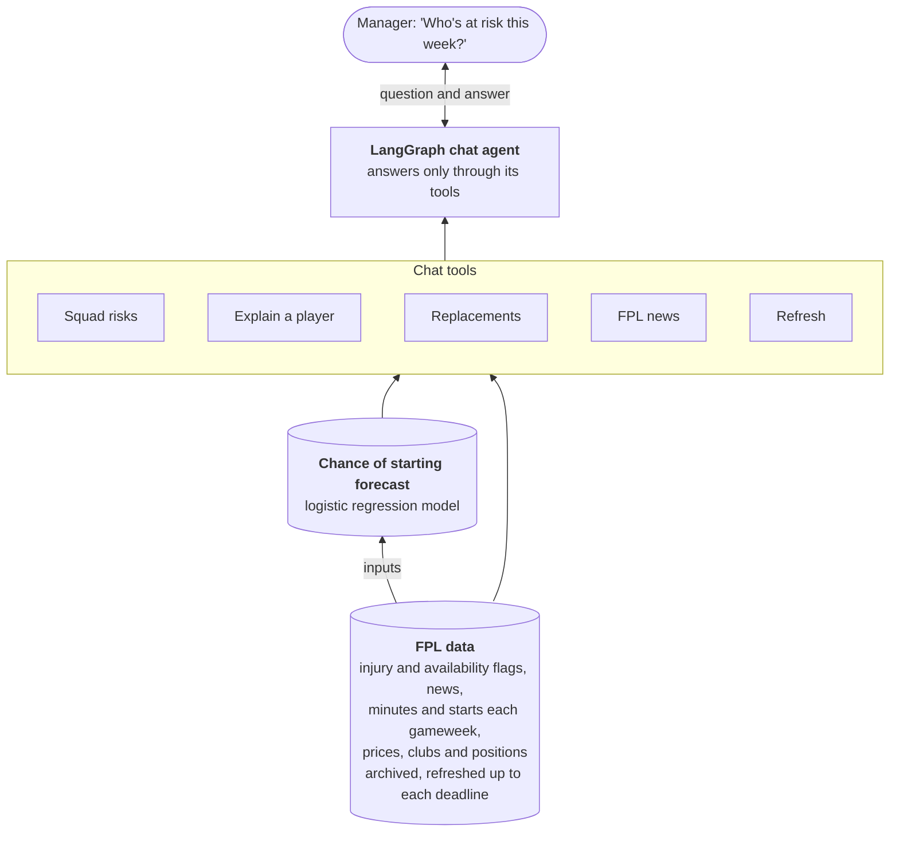

# fpl-starts

**A chat-based decision platform for Fantasy Premier League, grounded in an
interpretable statistical model.**

Fantasy Premier League has over 11 million users, or "managers". Each week
every manager must decide which transfers to make and which 11 of their 15
players to start. Only players who take to the field can score points, so
knowing who is likely to start helps managers make better decisions.

This repo provides a chat-based interface that lets managers ask questions
such as:

* For each player in my squad, what's his chance of starting?
* Why is João Pedro only 38%?
* Who could replace him?

The answers are grounded in a statistical model trained on several seasons
of player and availability data, rather than letting the LLM generate an
answer from its training data.

## How it works

Three layers, each only trusting the one below it:

1. **A statistical model.** An interpretable logistic regression estimates
   each player's chance of starting his club's next match. It's leakage-safe,
   frozen before the season and scored prospectively, and every prediction
   decomposes exactly into its reasons -- explained against a regular
   starter, in groups of inputs that belong together.
2. **Reproducible data.** A write-once archive of the FPL API, rebuilt into a
   SQLite layer and refreshed on request up to each gameweek's deadline; every
   refresh can register a new forecast, and every forecast is kept.
3. **A decision layer.** A Streamlit app and a LangGraph chat agent that know
   your actual squad (team ID plus the transfers you describe). The agent
   answers through tools over the model and data -- squad risks with legal
   bench swaps, replacements within your budget, FPL news, refreshes -- and
   says plainly what the model can't answer (points, captaincy).



> **Modelling case study:** see
> [`notebooks/logistic_p_start_model.ipynb`](notebooks/logistic_p_start_model.ipynb)
> for the feature-selection, temporal-validation, calibration and
> player-level explainability walkthrough. For the chat agent -- how a
> question flows through the graph, the tools and the refresh -- see
> [`dashboard/README.md`](dashboard/README.md).

## Any LLM, chosen on evidence

The chat agent isn't tied to one LLM provider. It runs on **Claude or
OpenAI models**, and switching is a configuration change (`LLM_PROVIDER`
and a model name in `.env`), not a code change: the prompt, tools, LangGraph
agent, conversation memory and tracing are the same whichever model answers.

That makes the real question which model is good enough, and an eval
harness answers it. Each candidate runs the same golden questions through
the real agent and tools, on fixed synthetic data, and every answer is
scored by deterministic rules, not by another model:

- **Routing** -- did it pick the right tool, with the right arguments?
- **Trajectory** -- did it call the tools the question needs, and no more?
- **Numeric faithfulness** -- is every % and £ figure in the answer backed
  by a tool result, rather than invented?
- **Scope** -- does it decline points and captaincy questions instead of
  giving a verdict the model can't support?
- **Conversation continuity** -- does it understand "him" or "yes" from the
  previous turn?

The first benchmark compared Claude Opus 5 with GPT-5 nano, the cheapest
OpenAI model (5 runs of each case):

| | Claude Opus 5 | GPT-5 nano |
|---|---|---|
| Routing: right tool | 100% | 78% |
| Numeric faithfulness | 100% | 100% |
| Scope | 96% | 80% |
| Conversation continuity | 100% | 100% |
| Median time per answer | 7.1 s | 17.6 s |
| Cost per 1,000 conversations | $40 | $1.21 |

GPT-5 nano is about 33 times cheaper, but it routes questions unreliably and
answers captaincy questions it should decline, so **Claude stays in
production**. The comparison also exposed a tool-schema bug that only the
OpenAI model triggered, now fixed for every provider. The method, every
failure and the promotion rule are in
[`notebooks/llm_model_benchmark.ipynb`](notebooks/llm_model_benchmark.ipynb);
switching models is described in
[`dashboard/README.md`](dashboard/README.md#choosing-the-model).

## The statistical model

`src/fpl_starts/ml/` holds `logistic_availability`: a six-predictor logistic
regression (FPL availability status, last gameweek's role, minutes in the
three gameweeks before that, this season's and last season's start rate,
new-signing flag) built so every coefficient can be read on its own and
every prediction is stored with its full log-odds breakdown.

- Trained on 2023-24 to 2025-26 only, then frozen; 2026-27 is scored
  prospectively and never used to refit, retune or recalibrate it.
- On the development seasons it cuts Brier by 24.6% overall and 18.9% in
  the Rotation stratum against a naive P(start | started last gameweek).
- Every prediction snapshot stores, per player, each feature's raw value,
  transformed value, coefficient and contribution, plus the intercept,
  logit and probability -- ready for a conversational layer to explain.
- Needs local historical inputs under `data/` that are intentionally not
  distributed with this repository.

See `docs/logistic_p_start_model.md` for the operational reference
(commands, outputs, the rules around the frozen model, how to read a stored
prediction) and `docs/logistic_p_start_modelling_log.md` for the decisions
behind it.

## What's here

- **`api.py`** -- thin FPL API client.
- **`archiver.py`** -- write-once, gzip, manifest raw archive of
  `bootstrap-static`/`fixtures`/`event/{gw}/live`. This is the one component
  with an unrecoverable-if-missed deadline: availability fields
  (`status`, `chance_of_playing_next_round`, `news`) are live state with no
  history endpoint and no community-archive equivalent.
- **`derived.py`** -- SQLite layer (`teams`, `players`,
  `player_gameweek_stats`, `player_availability_snapshots`, `fixtures`,
  `predictions`), rebuilt from scratch by replaying the raw archive.
- **`ml/`** -- the logistic P(start) model: leakage-safe panel,
  preprocessing, walk-forward evaluation, train-once, and prediction
  snapshots with per-feature contributions.
- **`research/`** -- the aggregate analyses behind the case-study notebook.
- **`pstart.py`** -- the application-facing API: the latest registered
  forecast (or the frozen model applied live), with player names and each
  prediction's explanation. Fails clearly; never falls back to another model.
- **`explanation.py`** -- explains a prediction against a regular starter,
  in groups of inputs that belong together (availability, playing time at
  his club, last season), each with his chance without that issue.
- **`refresh.py`** -- on-request refresh: before the upcoming gameweek's
  deadline, archive FPL's latest availability, rebuild, and register a new
  forecast if any chance of starting changed.
- **`history.py`** -- start history across seasons (community archive +
  this project's own archive) and the write-once prediction-snapshot writer.
- **`scoring.py`** -- the calibration harness: Brier score and accuracy,
  stratified by how often a player actually starts (Core/Rotation/
  Marginal/Deep), against three baselines (persistence, season-rate,
  constant 0.9). `compare_models` scores several `model_version`s side by
  side against the same outcomes.
- **`quarantine.py`** -- moves any prediction snapshot whose `predicted_at`
  postdates its round's deadline out of the season directory, so a same-day
  rerun can never be mistaken for the real pre-deadline prediction.


## Running it

```
uv sync
```

### Before the deadline

```
uv run fpl-starts-archive                               # archive today's FPL data
uv run fpl-starts-derive                                # rebuild the derived SQLite layer
uv run fpl-starts-logistic-predict --target-round N     # frozen-model forecast for gameweek N
uv run fpl-starts-derive                                # rebuild again, to pick up predictions
```

Or, for the upcoming gameweek in one step (also what the dashboard's
"Check for latest FPL news" runs):

```
uv run fpl-starts-refresh      # latest FPL availability -> rebuild -> new forecast if any chance changed
```

It only runs before the upcoming gameweek's deadline, at most once every 30
minutes (`--cooldown-minutes`), and registers a new forecast snapshot only
when a player's chance of starting changed. Forecasts use availability
captured up to the deadline.

### After the gameweek

```
uv run fpl-starts-archive                       # pick up the finished gameweek's results
uv run fpl-starts-derive                        # rebuild to pick up actual outcomes
uv run fpl-starts-score --target-round N        # score gameweek N, by stratum
```

### Modelling

```
uv run fpl-starts-logistic-evaluate                # historical walk-forward
uv run fpl-starts-logistic-train                   # fit and freeze (once)
uv run fpl-starts-logistic-case-study              # aggregates for the notebook
uv run --group notebook jupyter nbconvert --to notebook --execute --inplace \
    notebooks/logistic_p_start_model.ipynb
```

### Maintenance

```
uv run python -m fpl_starts.quarantine --season 2026-27 --dry-run
```

Check the dry run first: the 2026-27 GW1-5 logistic snapshots were
generated after their deadlines on purpose (retrospective replays, marked
`generated_after_deadline`), and a real run would move them out too.

Run from the repo root, these write `raw/` (the archive), `db/derived.db`
and `predictions/`. Each command takes `--help` for its full options; all
default to those relative paths, and an explicit flag always wins.

## Tests

```
uv run pytest                    # the root package, from the repo root (tests/)
cd dashboard && uv run pytest    # the dashboard's Streamlit AppTests (dashboard/tests/)
```

The dashboard tests need Streamlit, so they run separately in the
dashboard's own environment; the root `uv run pytest` collects `tests/`
only. Both use synthetic inputs -- no network, API key or local data.

## Dashboard and chat agent

`dashboard/` is the decision layer: the Streamlit app and LangGraph agent
described above. It's its own nested Python project (separate
`pyproject.toml`/venv); see [`dashboard/README.md`](dashboard/README.md) for
the details.

```
cd dashboard
uv sync
uv run streamlit run app.py
```
