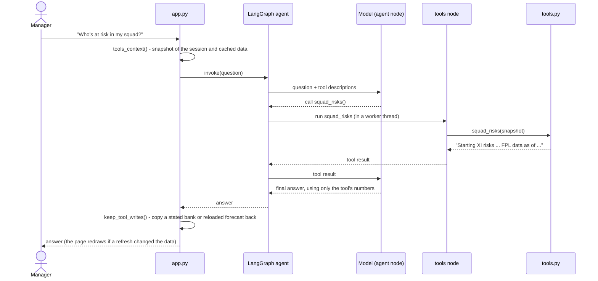
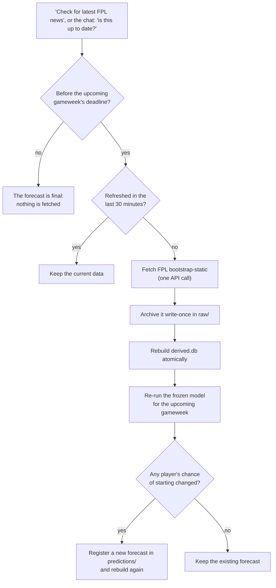

# Who's likely to start? -- the chat decision layer

The decision layer of `fpl-starts`: a chat interface for FPL managers,
grounded in the frozen statistical model `logistic_availability_v1`. A
manager enters their FPL team ID, tells the app about any transfers since
the last gameweek, sees each player's chance of starting with the reason
behind it, and asks a LangGraph agent about their squad -- who's at risk,
who could replace whom within budget, who's injured. The agent answers only
through tools over the model and data: it phrases the answer, the model
supplies every number.

It lives inside `fpl-starts` as its own nested `pyproject.toml`/venv:
a Streamlit/LangGraph app has no business sharing a dependency set with the
modelling pipeline it reads. `fpl_starts` is consumed as a normal editable
dependency (`path = ".."`).

## Setup

```
uv sync
uv run streamlit run app.py
```

The chat needs an LLM provider's API key -- see **Choosing the model**
below. `llm.py` loads the settings with `python-dotenv` from the `.env`
file in the `fpl-starts` root when it's imported; variables already set in
your environment win over the file, and nothing outside this repo is read.
`.env` files are gitignored.

### Choosing the model

The agent doesn't know which provider it's talking to: `llm.py` builds the
chat model from configuration, and that's the only place that knows about
Anthropic or OpenAI. The prompt, tools, graph, memory, tracing and evals are
the same for both.

| Setting | Meaning | Default |
|---|---|---|
| `LLM_PROVIDER` | `anthropic` or `openai` | `anthropic` |
| `ANTHROPIC_MODEL` | model when the provider is Anthropic | `claude-opus-5` |
| `OPENAI_MODEL` | model when the provider is OpenAI | `gpt-6-sol` |
| `LLM_MAX_TOKENS` | maximum output tokens per model call | `8000` |
| `ANTHROPIC_API_KEY` / `OPENAI_API_KEY` | the selected provider's key -- only that one is needed | -- |
| `ANTHROPIC_WORKSPACE_ID` | Anthropic only: needed if the key isn't scoped to one workspace | -- |

An unknown provider or a missing key for the selected provider stops the
chat with a clear message (the rest of the page still works). There's no
automatic fallback: if the configured provider is down, the chat fails
rather than sending the question to another provider. The app logs the
provider and model in use (`LLM provider: ..., model: ...`) whenever a
session's agent is built, and every LangSmith trace carries them as
`llm_provider` / `llm_model` metadata.

**Switching production** (on shed): edit `~/repos/fpl-starts/.env`, then
restart. For Anthropic:

```dotenv
LLM_PROVIDER=anthropic
ANTHROPIC_MODEL=claude-opus-5
ANTHROPIC_API_KEY=...
```

For OpenAI:

```dotenv
LLM_PROVIDER=openai
OPENAI_MODEL=gpt-6-sol
OPENAI_API_KEY=...
```

```bash
sudo systemctl restart fpl-dashboard
sudo systemctl status fpl-dashboard
sudo journalctl -u fpl-dashboard -n 20 --no-pager   # after a first chat: "LLM provider: ..., model: ..."
```

Then ask one question in the app and check its LangSmith trace shows the
expected `llm_provider` and `llm_model`. Before treating a new model as
accepted, run the provider smoke test and the evals against it (see **Live
evals**). No Python changes are needed.

The same pattern would extend to embeddings if retrieval is ever added
(`build_embedding_model(EmbeddingConfig)` beside `build_chat_model`); the
agent doesn't use embeddings today, so there's no embedding layer.

`data.py` resolves `models/`, `predictions/`, `data/`, `raw/` and
`db/derived.db` from the repo root, whatever the working directory;
`FPL_DASHBOARD_FPL_STARTS_DB` overrides the database path. Nothing outside
this repo is read.

After changing anything other than `app.py`, restart the app -- Streamlit
re-runs `app.py` on every interaction but keeps imported modules loaded.

## Your squad first

The app opens by asking for your FPL team ID, checks it exists (FPL's
`entry/{id}/`), and loads your official squad as it stood at the end of the
last completed gameweek (`entry/{id}/event/{gw}/picks/`, which also gives
your bank). Those two calls, once per session, are the only per-user FPL
API requests: the player list (names, clubs, positions), prices, news and
the last completed gameweek come from `db/derived.db`, built from the
archive.

It then asks what you've changed since -- "No changes", "João Pedro out for
Calvert-Lewin", "sold A and B and bought C and D" -- and resolves each named
player to a stable FPL player code (accents and punctuation don't matter; an
unknown or ambiguous name, an outgoing player not in the squad or an
incoming one already in it is refused with nothing changed). Everything
after that -- the predictions, the player drill-down and the chat -- uses
that current squad: official squad + your transfers. The official squad
itself is never changed; "Change team" clears everything for the team.

## Where the chance of starting comes from

Everything goes through `fpl_starts.pstart` -- the dashboard never builds
features or applies coefficients itself. The app shows the latest registered
`logistic_availability_v1` forecast for the upcoming gameweek: the snapshot
in `predictions/` written by `fpl-starts-logistic-predict` or
`fpl-starts-refresh`. There are no source or gameweek options.

Each prediction is explained against a regular starter (available, played
60+ minutes last gameweek and all of the 3 before, started every game this
season and last -- 96% in the frozen model), by `fpl_starts.explanation`,
in three groups of inputs that belong together: **availability**, **playing
time at his club** (last gameweek, the 3 before, start rate this season,
first game at his club) and **last season**. Each group shows the facts
behind it, how much it's holding him back, and his chance without that
issue -- always a real, consistent player, never one input changed on its
own. The groups add up exactly to the prediction. In gameweeks 1-4, when
"last gameweek" still reaches into last season, the two playing-time groups
are shown as one.

## How the chat works

The chat is a LangGraph ReAct agent (`create_react_agent`, with the model
from `llm.py` -- Claude by default). Its graph is a loop: the **agent** node
(the model) either answers or asks for a tool; the **tools** node runs it
and hands the result back; repeat until the model answers. The model never
calculates a number itself -- every number in
an answer comes from a tool, and every tool answer says when our FPL data
is from.

One question, end to end:



LangGraph runs tool calls in worker threads, where Streamlit's session state
and caches aren't available. So before each question `app.py` builds a
snapshot of the session and the cached data on its own thread, the tools
only ever touch that snapshot, and anything they change is copied back
afterwards.

The tools (`tools.py`, wrapped for LangGraph in `agent.py`):

| Tool | Answers | Built on |
|---|---|---|
| `get_my_current_squad_predictions` | "How's my team looking?" | forecast + explanation for the current squad |
| `explain_player` | "Why is Palmer only 80%?" -- any player | forecast, explanation, price and FPL news |
| `squad_risks` | "Who's at risk?" -- starters under 75%, and bench swaps that keep a legal formation | forecast + FPL's formation rules |
| `find_replacements` | "Who could replace Greaves for £5m?" | forecast, prices, bank (an estimate unless the user gives theirs), 3-per-club limit |
| `player_news` | "Is Saka fit?" -- and whether his status changed since the forecast | FPL news in derived.db vs the forecast's inputs |
| `refresh_fpl_data` | "Is this up to date?" | `fpl_starts.refresh` (below) |
| `get_gameweek_report` | "How did the model do in GW5?" | `fpl_starts.scoring` |

The agent only speaks to chance of starting: it has no model of points,
fixtures' difficulty or value, so it declines "who should I captain?" and
says so.

### Conversation memory

The chat remembers the conversation, so "yes" can accept an offer from the
previous answer and "find replacements for him" knows who "him" is. Two
kinds of state are kept apart:

- **Conversation state** -- what was just said -- belongs to LangGraph. The
  session's agent is built with its own `InMemorySaver` checkpointer, and
  every question is sent with the session's thread ID
  (`configurable.thread_id`, see `agent.thread_config`). Each invoke sends
  only the new question; the earlier turns come from the checkpointer.
  `chat_history` in the session is only what the page draws.
- **Business state** -- the squad, forecast, prices and news -- still comes
  from the fresh `tools.Context` snapshot built before every question, never
  from anything checkpointed. (An earlier tool *answer* in the conversation
  can be older than the data, though; the model calls the tool again when it
  needs current numbers.)

The thread ID is an opaque UUID, made once per Streamlit session. **New
chat** (shown once there's a conversation) and **Change team** start a new
one; a data refresh doesn't.

Memory is per session and per server process: it's lost when the app
restarts or the browser starts a new session. Durable conversations would
mean swapping `InMemorySaver` for a persistent checkpointer -- nothing else
changes. A thread keeps every message for now; long conversations would
eventually need trimming or summarising.

**Tracing is separate.** When LangSmith tracing is switched on (the
`LANGSMITH_*` variables in `.env`), the same thread ID goes into each
question's trace metadata (`thread_id`, with `app`, `season` and
`gameweek`), so LangSmith's Threads view groups one conversation's traces
together. That's for looking at conversations, not for remembering them:
the agent's memory is the checkpointer, never LangSmith.

## Keeping the data fresh

"Check for latest FPL news" and the chat's refresh tool run
`fpl_starts.refresh` -- for everyone using the app, not just the person who
asked:



One refresh runs at a time (a lock file beside the database). Forecasts use
availability captured up to the deadline. Because it writes to `raw/`, `db/`
and `predictions/`, the app needs a writable disk.

## What's here

- **`app.py`** -- the onboarding steps, then the current squad's page:
  predictions across the full width (chance of starting, availability,
  last-GW role, start rates, and a per-player breakdown of what's holding him
  back), then the chat below them, with its input pinned to the bottom of
  the window so it's always in view.
- **`squad.py`** -- the onboarding state machine (`NO_TEAM` ->
  `TEAM_ID_VALID` -> `OFFICIAL_SQUAD_LOADED` -> `TRANSFER_STATE_CONFIRMED` ->
  `CURRENT_SQUAD_READY`), transfer parsing and player-name resolution.
  Framework-agnostic: it works on any mapping, `st.session_state` or a dict.
- **`tools.py`** -- the chat's tools, as plain functions over a snapshot of
  the session and the data.
- **`agent.py`** -- the LangGraph agent and its system prompt; wraps the
  tools for the app. `uv run python agent.py "your question"` for a quick
  check outside Streamlit.
- **`llm.py`** -- the chat model: provider and model from configuration
  (`LLM_PROVIDER` etc.), the one place that knows about Anthropic and OpenAI.
- **`data.py`** -- all data access: the forecast via `fpl_starts.pstart`,
  players, prices, news and the last completed gameweek from
  `db/derived.db`, scoring via `fpl_starts.scoring`, the refresh via
  `fpl_starts.refresh`, and the two FPL manager-team API calls.

## What this doesn't do (yet)

- No points, captaincy or transfer-value advice -- only who's likely to start.
- No exact transfer budget: FPL doesn't publish selling prices, so the bank
  after transfers is an estimate unless the user gives theirs.
- No chat memory across server restarts or browser sessions -- only within
  one session (see Conversation memory).

## Tests

The root suite (`uv run pytest` from the repo root) covers the P(start)
service, `data.py`, the squad logic, every chat tool and the refresh end to
end on synthetic inputs -- no Streamlit, network or API key
(`tests/test_pstart.py`, `test_dashboard_squad.py`, `test_dashboard_tools.py`,
`test_refresh.py`). The app itself is covered by Streamlit AppTests
(`dashboard/tests/`; `uv run pytest` from this directory), including real
tool calls run through LangGraph by a scripted chat model, so no API calls
are made. `tests/test_conversation_memory.py` covers the thread/checkpointer
contract with a fake model.

### Live evals

These call the configured model's API (so they cost money and aren't part
of pytest) on
the synthetic data in `tests/fakes.py`; run them from this directory (the
keys come from the repo-root `.env`, loaded by `llm.py`):

- `uv run python -m evals.provider_smoke` -- can the model bind a tool,
  return a structured tool call and continue from its result? The minimum
  the agent needs; run it first when trying a new provider or model.
- `uv run python -m evals.routing_eval` -- the model's first decision only:
  which tool, which arguments. Cheap; nothing is executed.
- `uv run python -m evals.end_to_end_eval` -- one question through the whole
  agent and the real tools, scored on tool trajectory, numeric faithfulness
  and scope (`evals/scoring.py`).
- `uv run python -m evals.multi_turn_eval` -- short conversations whose
  second turn needs the first ("him", "yes"), scored on conversation
  continuity and the same three checks.

Each takes `--runs N`, since the model's answers vary from run to run, and
`--provider` / `--model` to evaluate a model other than the configured one
(e.g. `--provider openai --model gpt-6-sol`).
`uv run python -m evals.compare_models --model anthropic:claude-opus-5
--model openai:gpt-6-sol --runs 5` runs all three for each model and prints
a side-by-side table of pass rates, latency and reported token usage. Add
`--out evals/results/<name>.json` to save every run;
`notebooks/llm_model_benchmark.ipynb` turns a saved file into the case for
promoting (or not) a model -- quality gates first, then cost and latency.
