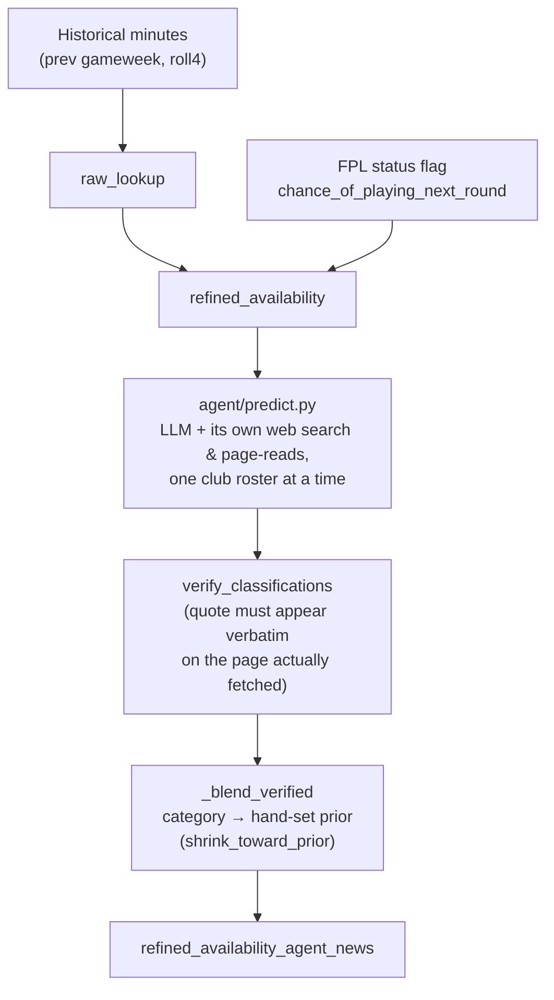

# P(starts): how the three models work

This is a reader's guide to the three `model_version`s this repo predicts
and scores, how they layer on top of each other, and how the agent's
claim priors work and change over time. For the formal design spec of the
base model, see `docs/build_spec_p_starts.md`; this document is a shorter,
narrative companion to it, and the only one that covers the agent.

## Why more than one model

Every arm below is scored against the same real outcomes, every gameweek,
via `fpl_starts.scoring`. Nothing here is trusted because it sounds
reasonable — it earns its place (or gets dropped) by beating the arm below
it, stratified by how often a player actually starts (Core/Rotation/
Marginal/Deep — see "Scoring discipline" below). Three arms, not one,
because each is a specific, falsifiable hypothesis about what additional
evidence is worth adding on top of the last.

## The three arms

| `model_version` | adds |
|---|---|
| `raw_lookup` | historical minutes-based lookup only |
| `refined_availability` | + FPL's own `chance_of_playing_next_round` status flag |
| `refined_availability_agent_news` | + an AI agent gathering its own web evidence per club |

`refined_availability_agent_news` layers on top of `refined_availability`'s
own output rather than replacing it — a player the agent finds no
evidence for just keeps `refined_availability`'s number.



### `raw_lookup`

A lookup table crossing `prev` (started last gameweek? 0/1) and `roll4`
(share of the last 4 games started, binned into 0%/25%/50%/75-100%) —
observed frequency per cell, no regression, no fitting. Two features, up
to 8 cells (`prev` × 4 bins), but one combination is structurally
impossible (started last week yet 0 of the last 4, since last week is
itself one of the last 4) — 7 real cells.

**Worked example**, fitted on 2025-26 plus GW1-3 of 2026-27 (the actual
training window `predict_gameweek` used for round 4):

| `prev` | `roll4` bin | observed start rate | `n` |
|---|---|---|---|
| 0 | 0% (0 of last 4) | **0.039** | 18,316 |
| 0 | 25% | 0.233 | 1,575 |
| 0 | 50% | 0.268 | 1,141 |
| 0 | 75-100% | 0.430 | 763 |
| 1 | 25% | 0.593 | 783 |
| 1 | 50% | 0.688 | 1,112 |
| 1 | 75-100% | **0.843** | 6,843 |

So a player who started last gameweek and 3 of their last 4 (`prev=1`,
`roll4`-bin 75-100%) gets `p_start = 0.843` — literally the fraction of
every player-gameweek in that exact cell, across the last season and a
bit, that went on to start the next one. A player who didn't start last
week and started none of their last 4 gets `p_start = 0.039`. Nothing is
regressed or smoothed within a cell; the only fallback (`min_cell=50`,
none triggered above — every cell here is comfortably larger) is to the
coarser `prev`-only rate (0.801 / 0.079) for a cell too sparse to trust on
its own, e.g. early in a season before much roll4 history exists.

### `refined_availability`

Layers FPL's own status fields on top of `raw_lookup`.

**The status fields.** Every player carries two live fields, refreshed
whenever `bootstrap-static` is archived:

| field | values | meaning |
|---|---|---|
| `status` | `a` / `d` / `i` / `s` / `u` | available / doubtful / injured / suspended / unavailable |
| `chance_of_playing_next_round` | `null`, 0, 25, 50, 75, 100 | FPL's own percentage estimate |

Two are used, differently:

- **`status` in `{i, s, u}`** — a hard gate. `p_start = 0.0` immediately,
  `method = "hard_gate_unavailable"`, no lookup involved at all. Injured,
  suspended, or explicitly unavailable players never reach the flag table
  below.
- **`status == 'd'`, or `chance < 100`** (and not already hard-gated) — the
  "doubtful" population, routed through the flag table. This also catches
  a player FPL still marks `status == 'a'` but has graded below 100% —
  `status` and `chance` don't always move together.
- **Everything else** (`status == 'a'` and `chance` is 100 or `null`) —
  untouched; `raw_lookup`'s own prediction stands.

**The flag table.** Doubtful/graded players are bucketed by their exact
`chance` value (`chance_0`/`chance_25`/`chance_50`/`chance_75`, or
`doubtful_no_chance` for `status == 'd'` with `chance` null or 100 — a
manager says "doubtful" before FPL has attached a percentage yet), crossed
with `prev` only — never `roll4`, since the doubtful population is small
enough that `roll4` cells wouldn't fill. Same `min_cell=50` fallback
discipline as `raw_lookup`: a specific (bucket, `prev`) cell too sparse
falls back to the pooled rate for that `prev` across *every* bucket, and
if even that's too sparse, the row keeps its unmodified `raw_lookup`
prediction untouched.

**Worked example**, real GW4 prediction: Azeez (Brighton) was flagged
`status = 'd'`, `chance = 75` — FPL's own 75% estimate. His `raw_lookup`
prediction (from the `raw_lookup` table above — he hadn't started his
last game or any of his previous 4) was **0.039**. The specific
`(chance_75, prev=0)` cell this season had only 25 observations — below
`min_cell=50`, too sparse to trust on its own — so it falls back to the
pooled rate for `prev=0` across every doubtful/graded bucket: **0.0035**
(from 284 observations, `method = "flag_table_pooled"`). That's Azeez's
final `refined_availability` number — *lower* than his own `raw_lookup`
rate, despite FPL's badge nominally reading "75% chance." That's not a
bug: the pooled bucket this early in the season is dominated by players
flagged `chance_0` (256 of the 284 pooled observations for `prev=0`, who
essentially never start), and there isn't yet enough graded-specific
history to separate a 75%-chance player from that pool. Worth watching as
more gameweeks accumulate and each bucket's own cell — not just the
pooled fallback — starts clearing `min_cell` on its own.

### `refined_availability_agent_news`

An LLM given one club's roster, its own web-search and page-reading
tools, and asked to classify each player using the fixed taxonomy below —
gathering its own live evidence rather than reading pre-scraped articles.
Classify-then-lookup, not classify-then-guess-a-number: the model only
ever returns a category and a verbatim quote, `categories.py` — not the
model — decides what that category is worth. Every classification is
re-verified against the actual fetched page text before it's trusted
(`verify_classifications`), and a unanimous, uncontested `confirmed_out`
is the only thing allowed to hard-gate a player regardless of what FPL's
own status flag already decided.

## The claim taxonomy

`agent/categories.py` classifies evidence into five categories:

| category | hand-set prior | treatment |
|---|---|---|
| `confirmed_out` | 0.0 | hard gate — overrides everything, never shrunk |
| `confirmed_starting` | 0.90 | shrunk toward this season's own observed rate |
| `rotation_risk` | 0.50 | shrunk toward observed rate |
| `returning_from_injury` | 0.35 | shrunk toward observed rate |
| `available` | *(none — no-op)* | never priced; defers entirely to `refined_availability`'s own number |

`available` (added 2026-09-15) is the odd one out: it means "fit/eligible,
but no specific lineup claim" — e.g. "will be available", "has returned
from injury". It's deliberately **not** in `CATEGORY_PRIORS`
(`NO_OP_CATEGORIES` instead). A hand-set number here would be worse than
doing nothing, since `refined_availability` already derives fitness from
FPL's own status flag — an actual medical/club assessment, continuously
updated — a far stronger basis than one scraped quote. Before this
category existed, that kind of claim had nowhere correct to go and risked
being misread as `confirmed_starting` instead (confirmed in a companion
repo that reimplements the same taxonomy independently — see that repo's
`docs/gameweek-summary.md` "Post-GW4 retrospective" entry for the real
cost found there and the retrospective simulation that validated the fix
before either repo's taxonomy changed).

## Priors, and how they change over time

Three of the five categories (`confirmed_starting`, `rotation_risk`,
`returning_from_injury`) don't use their hand-set prior directly — they
run it through `shrink` (`agent/categories.py`):

```
p = (prior × K + observed_sum) / (K + observed_n)
```

`K = 10` — read as "the hand-set prior is worth 10 pseudo-observations."
`observed_sum`/`observed_n` (`fit_category_rates`) are that category's own
*actual* starts/claims from every earlier round this season (never the
round being predicted — that would leak the answer). Two consequences
worth being explicit about:

- **At `observed_n = 0`** (no history for that category yet), `p` is
  *exactly* the hand-set prior. That's true for every category in the
  agent's very first predicted gameweek — there's nothing to shrink
  toward yet.
- **As `observed_n` grows**, the weight shifts from the guess toward this
  season's own fitted rate:

  | `observed_n` | weight on the hand-set prior |
  |---|---|
  | 0 | 100% |
  | 5 | 67% |
  | 10 | 50% |
  | 20 | 33% |
  | 50 | 17% |

  Past `observed_n = 10` (`= K`), the *empirical* rate carries more weight
  than the original guess.

**Why this matters for reading any early performance number:** the agent
arm doesn't yet have a single gameweek of genuinely pre-deadline, scoreable
history (its earliest real predictions were dev/test runs against
already-decided fixtures, correctly excluded from scoring by
`quarantine.py` — see that module's docstring). So every category is
still sitting at `observed_n = 0` for this arm specifically: any score it
gets in its first few real gameweeks is close to a direct test of the
hand-set guesses themselves (0.50 / 0.90 / 0.35), not yet a test of
whether the shrinkage mechanism has learned anything from this season.
Worth tracking `fit_category_rates`'s own `observed_n` per category
alongside the Brier score as real gameweeks accumulate, specifically to
know when a given category's number has crossed from "mostly a guess" to
"mostly fitted."

`confirmed_out` and `available` are exempt from all of this: `confirmed_out`
is a hard gate (always exactly 0.0, nothing to fit), and `available` is
never priced at all (see above) — neither has a "how it updates over time"
story, by design.

## Scoring discipline

Every arm is scored the same way (`fpl_starts.scoring.score_gameweek`):
Brier score and 0.5-threshold accuracy, against three baselines
(persistence, season-rate, constant 0.9), stratified by how often a player
actually starts:

- **Core** (≥50% of gameweeks), **Rotation** (15–50%), **Marginal** (<15%),
  **Deep** (never) — labelled from history strictly *before* the round
  being scored, never from the round itself (that would leak the answer
  into exactly the stratum that matters most).
- **Never a single pool-wide number.** Deep is ~40% of the pool and
  trivially predictable, which flatters any pool average into hiding the
  improvement (or damage) that actually matters. Rotation-stratum Brier is
  the headline metric.

`fpl_starts.agent.domain_stats` extends this specifically for the agent:
per-source-domain directional accuracy of its evidence, monitoring
infrastructure only (nothing feeds back into `predict.py`'s blend yet).

## Where things live

| what | file |
|---|---|
| base model, archiver, derived layer, scoring harness | `src/fpl_starts/{starts_model,archiver,derived,scoring}.py` |
| agent (web-search challenger) | `src/fpl_starts/agent/predict.py` |
| claim taxonomy → probability | `src/fpl_starts/agent/categories.py` |
| per-domain evidence accuracy | `src/fpl_starts/agent/domain_stats.py` |
| post-deadline snapshot quarantine | `src/fpl_starts/quarantine.py` |
